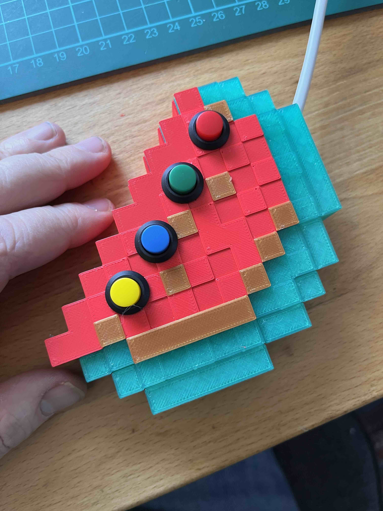
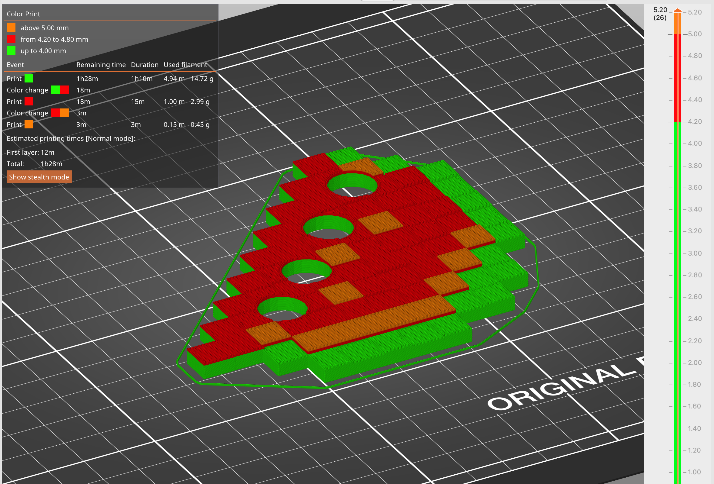
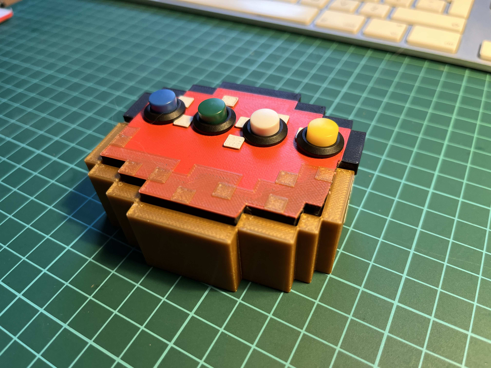
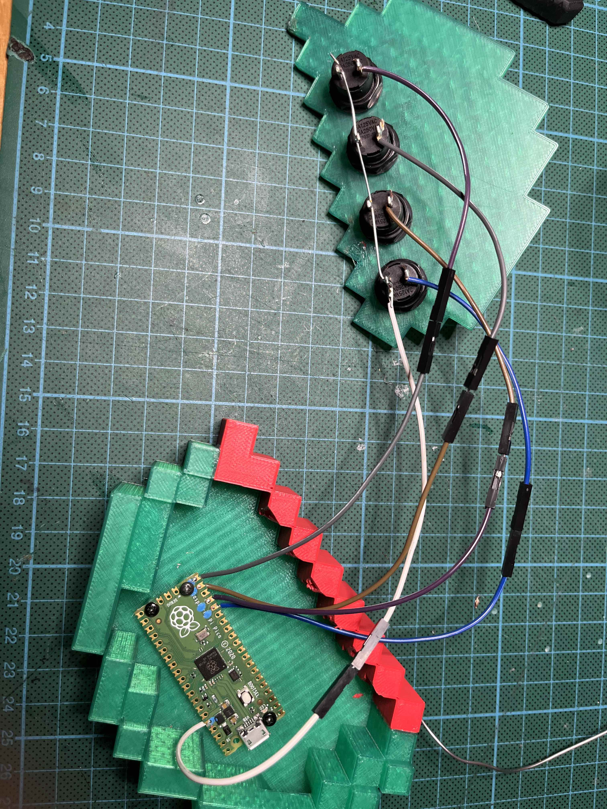

# MinecraftKeyboard
Ein "Keyboard" special für Minecraft. Basierend auf Raspberry Picco und CircuitPython

## Basis

Mit einem Raspi-Pico und entsprechender Hardware (ein paar alten Knöpfen oder so) und etwas Software kann man sich ein paar spezielle Knöpfe für wichtige, oft genuzte Funktionen in Minecraft basteln.

Ich möchte Funktionen wie `/gamemode 1` gerne mit einem Knopfdruck erledigen!

# 3D-Design

Es gibt eine Vorlage in TinkerCAD:

[Tinkercad Vorlage](https://www.tinkercad.com/things/9xmwdutPWXx)

Passende Schalter zum Beispiel:

[Taster bei Amazon](https://www.amazon.de/gp/product/B0BF51N8CK/?&_encoding=UTF8&tag=kidslab0e-21&linkCode=ur2&linkId=8c899cd49aa06d1d18715d5156132356&camp=1638&creative=6742)

## Melone

Das Design in TinkerCAD zum kopieren und bearbeiten findest Du hier: https://www.tinkercad.com/things/kLp4zv6Hxyj 

Zum Drucken verwenden wir die Funktion "Farbwechsel" (https://help.prusa3d.com/de/article/farbwechsel_1687/) - ich habe den Deckel mit den Farben Grün, Rot und Bronze gedruckt.

## Kuchen

Für den Kuchen gibt es auch ein Video, in dem ich erkläre, wie ich es genau gemacht habe:

https://youtu.be/ud2NVw5F7Nw

Das Design findet ihr hier: 

 https://www.tinkercad.com/things/fwZQRYf10Ix 

# Eletronik

Das "Gehirn" des Keypads ist ein Raspberry Pico. Der kostet ca. 4 Euro und erledigt die Arbeit: er übersetzt die Knopfdrücke in die Tastatur-Ausgabe. Dafür tut er so, wenn man ihn per USB anschließt, als ob er eine Tastatur wäre (sog. "Human Interface Device" oder HID).

## Verkabelung

Die ist sehr einfach:

Spannung: Pin 36 - 3V3

- Kommt auf alle Knöpfe gleich auf eine Seite

| Knopf | Funktion      | Pin Nr. | Pin Funktion |
| ----- | ------------- | ------- | ------------ |
| 1     | `/gamemode 1` | 20      | GP15         |
| 2     | `/gamemode 2` | 19      | GP14         |
| 3     | `F3` (Debug)  | 17      | GP13         |
| 4     | `/gamemode 3` | 16      | GP12         |

# Programmierung

Das ganze ist in CircuitPython Programmiert - eine Python-Version, speziell für dien Raspberry Pico. Das ist sehr einfach mit dem Editor "[Thonny](https://thonny.org/)" editierbar und kann einfach hochgeladen werden.

Das Programm prüft, ob an den einzelnen Input-PINs Storm ankommt - dann ist der Knopf gedrückt: jetzt wird das entsprechende Kommando als Tastatur-Anschläge übermittelt.

## Libraries

Wir benötigen eine Library, eine "Bibliothek" von zusätzlichen Funktionen: Mit dieser Erweiterung können wir mit dem Pico beibringen, dass er so tut, als sei er eine Tastatur oder Maus. 

https://learn.adafruit.com/welcome-to-circuitpython/circuitpython-libraries

https://circuitpython.org/libraries

http://docs.circuitpython.org/projects/hid/en/latest/

# Feedback & Fragen

Gerne! gregor@kidslab.de

